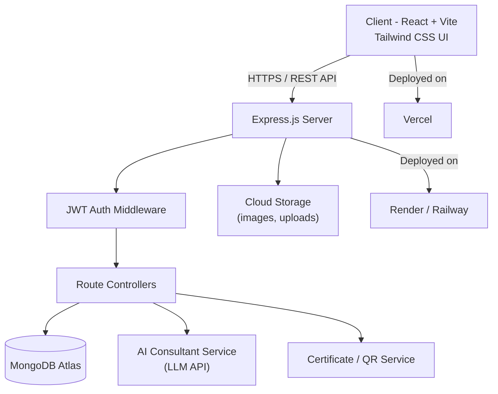
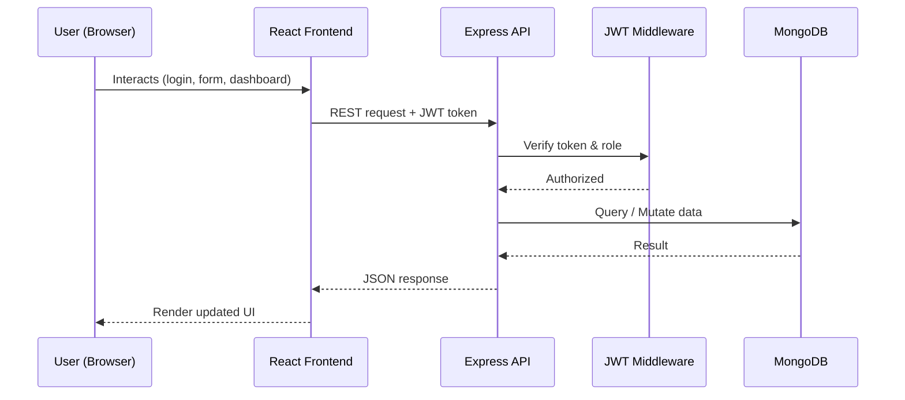
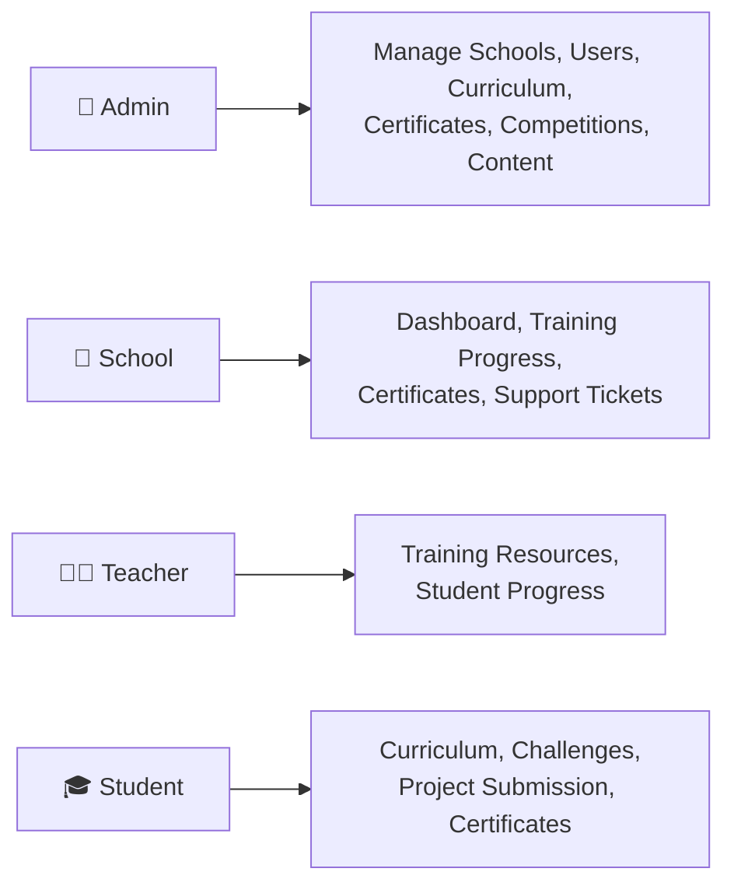

<div align="center">


<br/>

[](https://robo-learn-ten.vercel.app/)


</div>

<p align="center">
  
</p>

<p align="center">
A modern, interactive, and scalable <b>Robotics &amp; STEM Education ecosystem</b> for schools, students, and teachers — combining lab setup, curriculum, an AI consultant, dashboards, competitions, and certificate verification into one connected platform.
</p>

---

## 📑 Table of Contents

- [Overview](#-overview)
- [Live Demo](#-live-demo)
- [Core Features](#-core-features)
- [System Design](#-system-design)
- [Tech Stack](#-tech-stack)
- [Folder Structure](#-folder-structure)
- [Roles & Access](#-roles--access)
- [Getting Started](#-getting-started)
- [Environment Variables](#-environment-variables)
- [Roadmap](#-roadmap)
- [Author](#-author)

---

## 🌟 Overview

**RoboLearn** turns traditional classrooms into future-ready STEM labs. It bundles together everything a school needs to run a Robotics/AI/IoT program — from an **AI-powered consultant** that answers curriculum and lab-setup questions, to **role-based dashboards** for Admins, Schools, Teachers, and Students, to a **certificate verification system**, **support ticketing**, and a **student innovation showcase**.

It's built as a single full-stack MERN application with a clean, futuristic **dark navy / electric blue / cyan** design language.

## 🔗 Live Demo

👉 **[robo-learn-ten.vercel.app](https://robo-learn-ten.vercel.app/)**

---

## ✨ Core Features

| Module | What it does |
|---|---|
| 🏠 **Interactive Homepage** | Hero section, why-robotics, services overview, lab setup process, trust stats, consultation CTA |
| 🧠 **AI Robotics Consultant** | Chat-style assistant that answers lab, curriculum, and kit-recommendation questions |
| 🏗️ **Smart Lab Planner** | Takes student count, grade level, budget & goals → suggests a lab configuration |
| 📚 **Curriculum Explorer** | Grade → Subject → Level → Module → Project → Skills learning flow (Grade 3–12) |
| 🎓 **Student & Teacher Training** | Structured, project-based training tracks (Arduino, IoT, AI, PCB, embedded systems) |
| 🤖 **Products Catalog** | Robotics kits, sensors, controllers, dev boards, electronics components |
| 🚀 **Student Innovation Showcase** | Students publish projects with problem statement, components, demo video |
| 🏆 **Competition Hub** | Monthly challenges, submissions, leaderboards, winner showcase |
| 🏫 **School Dashboard** | Training progress, curriculum progress, certificates, support tickets, analytics |
| 🎓 **Digital Certificates** | Unique ID + QR-code based public certificate verification |
| 🎫 **Support Portal** | Ticketing system with priority, categories, file uploads, status tracking |
| 🔐 **Role-Based Auth** | JWT-secured Admin / School / Teacher / Student roles with protected routes |

> Some modules above represent the platform's full product vision — see [Roadmap](#-roadmap) for what's shipped vs. planned.

---

## 🧩 System Design

### High-Level Architecture



### Request Lifecycle



### Role-Based Access Model



**Design principles:**
- **Separation of concerns** — frontend (React/Vite) is fully decoupled from the backend (Express REST API).
- **Stateless auth** — JWT tokens carry role claims; every protected route is guarded by middleware, not client-side checks alone.
- **Single source of truth** — MongoDB stores users, schools, curriculum, certificates, and tickets as normalized collections.
- **Extensibility** — the AI consultant and certificate/QR system are built as independent services so they can be swapped or scaled separately from the core API.

---

## 🛠️ Tech Stack

<div align="center">

| Layer | Technology |
|---|---|
| **Frontend** | React, Vite, Tailwind CSS |
| **Backend** | Node.js, Express.js |
| **Database** | MongoDB (Mongoose) |
| **Auth** | JWT, bcrypt password hashing |
| **AI Layer** | LLM-based consultant integration |
| **Deployment** | Vercel (frontend), Render/Railway (backend) |
| **Design Theme** | Dark Navy · Electric Blue · Cyan Accents |

</div>

---

## 📁 Folder Structure

```
robolearn/
├── client/                    # React + Vite frontend
│   ├── src/
│   │   ├── components/        # Navbar, Sidebar, Cards, Widgets
│   │   ├── pages/              # Home, Dashboard, Curriculum, Products, etc.
│   │   ├── context/            # Auth & global state
│   │   ├── services/           # API calls (axios)
│   │   └── assets/
│   └── vite.config.js
│
├── server/                    # Node + Express backend
│   ├── models/                 # User, School, Curriculum, Certificate, Ticket
│   ├── routes/                 # REST endpoints per module
│   ├── controllers/            # Business logic
│   ├── middleware/             # JWT auth, role guard, error handler
│   └── server.js
│
└── README.md
```

---

## 🔐 Roles & Access

| Role | Access |
|---|---|
| 👑 **Admin** | Full control — schools, users, products, curriculum, competitions, certificates, tickets, analytics |
| 🏫 **School** | School dashboard, training & curriculum progress, certificates, support tickets |
| 👨‍🏫 **Teacher** | Training resources, curriculum tracking, student activity |
| 🎓 **Student** | Curriculum access, competitions, project submission, certificates |

---

## ⚙️ Getting Started

```bash
# Clone the repository
git clone https://github.com/Akshatsrii/robolearn.git
cd robolearn

# Install frontend
cd client
npm install
npm run dev

# Install backend (in a new terminal)
cd ../server
npm install
npm run dev
```

## 🔑 Environment Variables

Create a `.env` file inside `server/`:

```env
PORT=5000
MONGODB_URI=your_mongodb_connection_string
JWT_SECRET=your_jwt_secret
AI_API_KEY=your_ai_provider_key
```

---

## 🚀 Roadmap

- [ ] Real-time notifications (Socket.IO)
- [ ] Mobile application
- [ ] AI-based personalized learning recommendations
- [ ] Gamification & achievement badges
- [ ] National robotics leaderboard
- [ ] Parent dashboard
- [ ] Multilingual support

---

## 🎯 Mission

To make Robotics, AI, IoT, Coding, and Electronics accessible to students through practical, project-based education — and give schools the tools to run a modern STEM program end-to-end.

---

## 👤 Author

**Akshat Srivastava**

[](https://github.com/Akshatsrii)
[](https://leetcode.com/Akshatsrivastava007)


</div>
