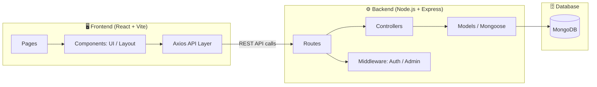
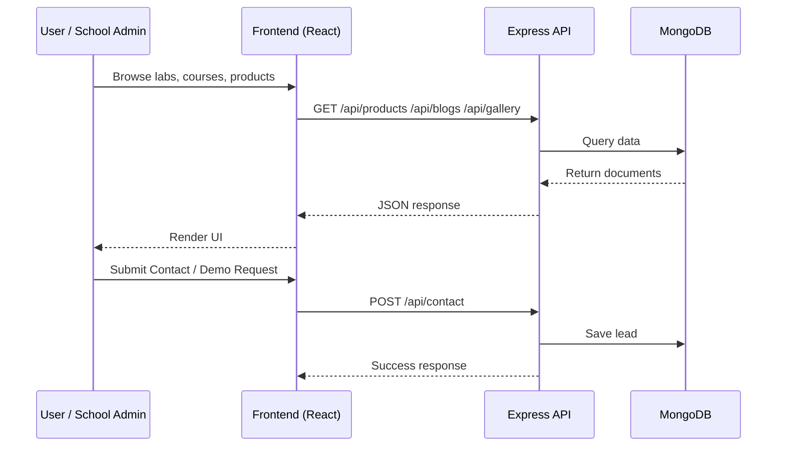

<div align="center">


# 🤖 RoboLearn

### Robotics Education & STEM Learning Platform

**Empowering Schools with Robotics Labs, STEM Curriculum & Future‑Ready Training**

<p>
  
  
  
  
  
</p>

</div>

---

## 📖 About

**RoboLearn** is a full-stack web platform that helps schools explore and adopt **Robotics Lab setups**, **STEM curriculum**, **teacher & student training programs**, and **educational robotics kits** — all through one modern, responsive website with a powerful admin dashboard.

---

## 🎨 Theme

| Element | Color | Hex |
|---|---|---|
| Background | 🟦 Dark Navy Blue | `#0a0f1e` |
| Primary | 🔵 Electric Blue | `#2563eb` |
| Accent | 🩵 Cyan | `#06b6d4` |
| Text | ⚪ White | `#ffffff` |

---

## 🧩 System Architecture



---

## 🔄 Request Flow



---

## 🗂️ Project Structure

```
RoboLearn/
├── frontend/
│   ├── src/
│   │   ├── pages/            → Home, About, LabSetup, Training, Products...
│   │   ├── components/
│   │   │   ├── layout/       → Navbar, Footer, Layout
│   │   │   └── ui/           → Button, Card, Modal, FormElements
│   │   ├── routes/           → AppRoutes.jsx
│   │   ├── App.jsx
│   │   └── index.css         → Design tokens (theme colors, typography)
│   └── index.html
│
└── backend/
    ├── models/                → User, Product, Blog, Gallery, Course, Curriculum, Testimonial, Partner, Contact
    ├── controllers/           → Auth, Product, Blog, Gallery, Contact
    ├── middleware/            → auth.js (JWT protect + adminOnly)
    ├── routes/                → REST endpoints
    ├── config/db.js           → MongoDB connection
    └── server.js               → Express app entry point
```

---

## ✨ Key Features

- 🏫 **Robotics Lab Setup** showcase for schools
- 📚 **STEM Curriculum** by grade group (3–5, 6–8, 9–12)
- 👩‍🏫 **Teacher & Student Training Programs**
- 🛒 **Educational Product Catalog** with categories & specs
- 📝 **Blog / Resource Hub**
- 🖼️ **Gallery** of labs, workshops & events
- 💬 **Testimonials** & School Partner showcase
- 📩 **Consultation / Demo Request** forms with lead tracking
- 🔐 **Secure Admin Dashboard** (JWT-based auth & role guard)

---

## 🛠️ Tech Stack

**Frontend:** React, Vite, React Router, Framer Motion, React Hook Form, Axios
**Backend:** Node.js, Express, MongoDB, Mongoose, JWT, Bcrypt
**Tooling:** ESLint, Git, GitHub

---

## 🚀 Getting Started

```bash
# Clone the repository
git clone https://github.com/Akshatsrii/RoboLearn.git
cd RoboLearn

# Setup backend
cd backend
npm install
cp .env.example .env
npm start

# Setup frontend
cd ../frontend
npm install
npm run dev
```

---

## 📌 Project Status

| Phase | Status |
|---|---|
| Day 1 — Architecture & Planning | ✅ Done |
| Day 2 — Frontend Setup | ✅ Done |
| Day 3 — Backend (Models, Controllers, Routes) | ✅ Done |
| Day 4 — Design System (UI Components) | ✅ Done |
| Day 5 — Layout (Navbar, Footer) | ✅ Done |
| Day 6+ — Pages (About, Lab Setup, Training, Products...) | 🚧 In Progress |

---

<div align="center">

Made with 💙 for the future of **Robotics & STEM Education**

</div>
